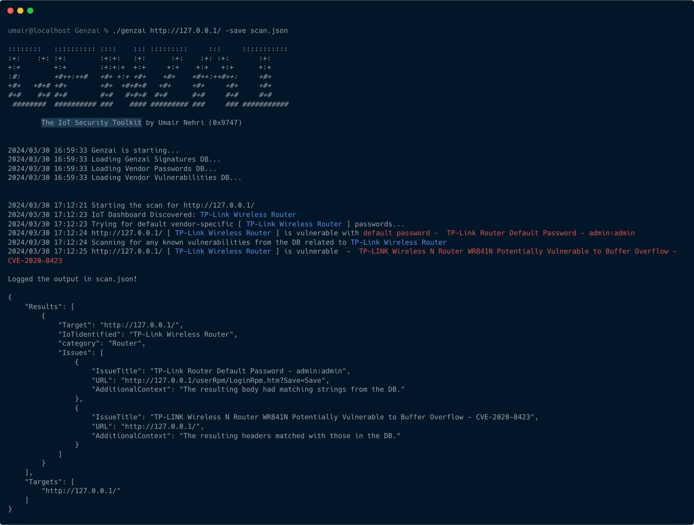

<h1 align="center">Genzai</h1>

<b>The IoT Security Toolkit</b>

<a href="#description">Description</a> • <a href="#features">Features</a> • <a href="./docs/documentation.md#setupnusage">Setup & Usage</a> • <a href="#acknowledgements">Acknowledgements</a> • <a href="#contact">Contact Me</a> 

  
  
  
  

 

<h2> Description </h2>
Genzai helps you identify IoT or Internet of Things related dashboards across a single or set of targets provided as an input and furthermore scan them for default password issues and potential vulnerabilities based on paths and versions.
  
An example would be an admin panel for a home automation device acceessible over the internet. The tool will firstly fingerprint the IoT (product) based on a set of signatures from <a href="./signatures.json">signatures.json</a> and then based on the product identified, and the relevant templates in its DBs (<a href="./vendor-logins.json">vendor-logins.json</a> and <a href="./vendor-vulns.json">vendor-vulns.json</a>), scan it for vendor-specific default passwords like  admin:admin as well as look for any potential vulnerabilities.
  
Genzai currently supports fingerprinting over 20 IoT-based dashboards and has the same amount of templates to look for default password issues across them. It currently has a total of 10 vulnerability templates which will increase with coming updates.

<h2> Features </h2>

<h4>Fingerprinting - The Wappalyzer of IoT Devices</h4>
With Genzai, you can fingerprint the IoT Product running over a target based on the HTTP response received through it. With a support of 20 templates and counting, Genzai can look for categories such as:
 

- Wireless Router
- Surveillance Camera
- HMI or Human Machine Interface
- Smart Power Control
- Building Access Control System
- Climate Control
- Industrial Automation
- Home Automation
- Water Treatment System

<h4>Default Password Checks</h4>
Based on the IoT product identified and the presence of a relevant template in <a href="./vendor-logins.json">Vendor Logins DB</a>, Genzai will also check if the target is still using a vendor-specific default password considering how several devices across the internet still use a default password letting anyone to log in as an administrative user.

<h4>Vulnerability Scanning</h4>
Also based on the IoT product identified and with the presence of a relevant template in <a href="./vendor-vulns.json">Vendor Vulns DB</a>, Genzai will check for any potential vulnerabilities across the target. While some of the templates actively flag issues based on an exposed endpoint or file, others may flag based on a vulnerable version.

<h2> Acknowledgements </h2>
Genzai has been or will be noticed at,
<ul type="disc">
<li><a href="https://www.blackhat.com/asia-24/arsenal/schedule/index.html#genzai---the-iot-security-toolkit-37373">Black Hat Asia 2024 [Arsenal]</a></li>
<li><a href="https://www.gisec.ae/gisec-armory">GISEC Armory Edition 1 Dubai 2024</a></li>

</ul>

<h2> Let's Connect! </h2>
If you have any questions or feedback about Genzai or just want to connect with me, feel free to reach out via <a href="https://in.linkedin.com/in/umair-nehri-49699317a">LinkedIn</a> or <a href="mailto:umairnehri9747@gmail.com">Email</a>.

<h2>Legal Disclaimer</h2>
Usage of Genzai for scanning or attacking targets without prior mutual consent is illegal. It is the end user's responsibility to obey all applicable local, state and federal laws. Developers assume no liability and are not responsible for any misuse or damage caused by this program.
